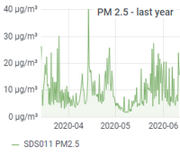

# Science

### [Solarmeter](./solarmeter) 

The project on renewable energy at AISVN in Nha Be, Vietnam, includes a 500W wind generator and three solar panels from 1W to 60W. Two ESP32 measure independently several key values every minute and submit the average of 5 mintues into a database and a Google sheet. Further detailled description at [sites.google.com/ais.edu.vn/solar](https://sites.google.com/ais.edu.vn/solar) .

### [Labs for physics, chemistry and biology](./labs) 

Labs with data as .csv or .xlsx as well as Jupyter Notebooks. Like determine the surface temperature of the sun by measuring the temperature change of water in a blacked test tube over time.

### [IB Physics slides and worksheets](./physics) 

Documents in pptx, docx, pdf and Jupyter notebook ipynb. Test questions and detailes answers.

### [AQI](aqi)

Several stations in Saigon measure the particles PM2.5 and PM10 together with humidity and temperature since 2018. It should provide a comprehensive data collection for students to understand the scope of the problem.

### [temp.hofkoh.de](./temp.hofkoh.de) 

Starting in November 2013 a DS18S20 onewire thermometer connected to a TP-Link TL-WR703N with OpenWRT and a DS9490R USB dongle was measuring the outdoor temperature in Hofkoh, Germany. Recent software and hardware updates have been made in Saigon.

### [Weatherstation](./weatherstation) 

Data collection since 2017, comprehensive analysis and documentation will follow. Planned for December 2020.

&nbsp;
&nbsp;

# Software

### [Machine Learning](ml)

Neuronal networks and artificial intelligence are discussed and explored since the 70s of the last century. But only recently the required computational power have become available to be used at scale. And now even works inside our smartphones! It helps understanding learning (I'm a teacher) and is a promising and interesting subject. Should be applied to the object detection on the Jetson Nano car.

### [Benchmark](benchmark)

Some benchmark software and results I've been using since 1991 when I compared the speed of a Basic interpreter to a C compiler calculating the prime numbers until 1000 on my Atari ST. Surpisingly the interpretation was significantly faster!

### [Python2018](python2018) 

Starting at the _BeTogetherConference_ of several international schools in Saigon I wrote my first lines in python on _2018/11/16_. Little did I know that soon I would be use it for lab reports in Jupyter notebooks and programming ML and data analysis in Kaggle.

### [AR65view](ar65view)

Developed since 2007 this little Java program visualizes the spectrometric data of the AR65 photoemission station from the EES group at the physics institute of the Humboldt Universit't zu Berlin. The original software repository can still be found on sourceforge.

&nbsp;
&nbsp;
&nbsp;

# Robotics

### [Jetson Nano powered car](jetson-car)

Using the Nvidia Jetson Nano I got in January 2020 we created our first self driving car with the 128 CUDA cores on object detection with tensorflow lite and object avoidance. A wide angle camera is directly connected, the chassis we got after TET and the initial delivery challenges from China in the wake of COVID-19. Little did we knew back then how this all would turn out!

### [DIY Actuator](actuator)

Inspired by the INNFOS Gluon project from the end of 2019. Before it was canceled. The steps into building a BLM actuator myself. Would be great to design something like the NDD-30 from INNFOS:

### [Open Source MeArm](me2arm)

Many files of the little robot arm __MeArm__ are open source, but some parts are still missing. Having a local laser cutting supplier and cheap servos lying around I tried to source the remaining parts as well. This led to my first PCB design!

### [ESP32](ESP32)

Collection of projects since 2018. Used for data collection in the [solarmeter](solarmeter) project, the core of the [T200](T200) robot car and many other data collection and controlling projects.

### [ESP8266](ESP8266)

After having some progress with Arduinos the projects start to grow pretty fast. With more CPU power, more storage and the need for connectivity like WiFi one soon ends up at the cheap ESP8266. So did I and took [my first steps](ESP8266).

### [T400](./T400) 

Robot car for ASA session III at AISVN. Programmed in MicryPython. Powered by an ESP8266. Started _2020/02/24_

### [T300](./T300)

Third iteration of student robots at AISVN. Started ASA session II at AISVN in __November 2019__. Was about to be finished in February 2020, but schools in Vietnam were closed after TET in January 2020. The prototype was finished and can be seen on the right. It includes:

- Motorshield L298 with buzzer on pin4
- 4 DoF robot arm with 4 servos on pin A0 to A3
- Bluetooth Low Energy connection with pin 0 and 1 (Serial1)
- PWM motor control on pin 10 to 13
- 1602 LCD display over I2C on pin 2 and 3 SDA SCL
- MPU6050 gyroscope for location control on I2C
- Ultrasonic distance with pin 7 (trigger) and pin 8 (echo/response)
- PS2X controller at pin 5 SC, 6 CLK, A4 DAT and A5 CMD

### [T200](./T200)

This new robot has a 32bit CPU with 240 MHz in its center - the ESP32. Bluetooth BLE and WiFi are now automatically included. The reverse engineering of the BLE protocol took some time, but now the speed control is analog and allows slow motion. Successfull implementation on __2019/04/07__. Half a year of learning documented the change from the T110 in the following areas:

- New 32bit CPU with 160 MHz insteat of 16 MHz
- Bluetooth 4.0 and BLE build in, no need for external module
- Needs 3.3 Volt instead of 5V, new controller DRV8833
- More memory with 512 kByte instead of 2.5 kByte

### [T110](./T110)

Inspired by the success with the T100 and the ability to control the robot with bluetooth on an Android smartphone I wanted to bring this experience to the many iPhones our students own. The journey started in October 2018 with a clone of the HC-10 and Bluetooth 4.0. Turns out that 4.0 is both the regular Bluetooth as well as the new BLE - Bluetooth Low Energy. The pairing and data transfer is completely different, way more sophisticated but in the way that it is designed consumes less power and much easier for the user (not the programmer). 

Getting Bluetooth Low Energy running is just one problem. The second one is to find a good free app in the Apple Appstore to use as remote. That's the journey of the T110 in October 2018 until it was abandoned in favor of the T200. We move from Arduino Uno to ESP32. Quite a lot changed!

### [T100](./T100)

This is the first working example of student robot with Bluetooth control. Created during our club time in 2018-2019. We had a [Presentation in black box](https://docs.google.com/presentation/d/1IE6vhY4cZSOWBHvVIj3YtGkaSpueGU_R7iqlo0ujIk4/edit?usp=sharing) on November 23rd, 2018. And two videos from October 2018: [30 seconds robot built](https://youtu.be/4jvJJgrxoKo) and [presentation of projects](https://youtu.be/MgGgulE-zuQ). The first one has been updated with music and [can be found here](https://youtu.be/CzpAYpl62GI). Software is from 2018/11/22.

### [T80](./T80)

Viet's robot for the [Sciencefair 2019](https://sites.google.com/ais.edu.vn/sciencefair2019) at AIS in the __Design__ category. I finished the car on March 6th, 2019. His team won!

Planned projects from December 2019 that never took off due to Covid-19

- [T500](./T500) __2020/02/02__ Robot car with 3 omnidirectional wheels, controlled by a Raspberry Pi 3.
- [T420](./T420) __2020/03/01__ Extended robot car from T400, controlled by a NVIDIA Jetson Nano.
- [T410](./T410) __2020/02/02__ Upgrade of T400 with Raspberry Pi 1B and 3.5 inch display 480x320 for 80x25 characters.

&nbsp;
&nbsp;
&nbsp;

# School projects

## [407B](407B)

In front of 407B should be a little selection of Arduino projects to get students interested.

### [ASA](./asa) 

Already the second iteration of student robots at [AISVN](https://ais.edu.vn). 60% of the 10 projects were successful. The "After School Activity" ASA ran from August to November 2019. For remote control we used Bluetooth 4.0 for both Android and iOS.

- [RFID](./rfid) Check out your serial number in your school ID card.
- [ultrasonic](./ultrasonic) Measure distance with ultrasound.
- [aisvn](./aisvn) __2020/03/10__ Platform standards for interoperability between different robot car generations.
- [ASA](./asa) __2019/10/03__ Second iteration of student robots at AISVN. 60% of the 10 projects were successful. Started August 2019.
- [asa2](./asa2) 
- [asa3](./asa3)
- [remote](./remote)
- [impact](./impact)

- [aisvn](./aisvn) __2020/03/10__ Platform standards for interoperability between different robot car generations.
- [407B](./407B) In front of 407B should be a little selection of Arduino projects to get students interested.
- [ultrasonic](./ultrasonic) Measure distance with ultrasound.
- [RFID](./rfid) Check out your serial number hidden in your school ID card.

&nbsp;
&nbsp;
&nbsp;

## [Movies](movies)

Motivated by conversations with friends I started in 2013 a list of recent movies and which of them I watched. By October 2014 the list contained 3800 movie titles in both english and german, dating back to 1921. The majority was from 1980 on, though. And I had watched 904 of them. [More on this project](movies).

## [History](history)

A little review of software I wrote since 1987. The oldest actual copy is a program in C++ from November 2000. The languages covered over this time are Basic, TurboPascal, Visual Basic, C, C++, php, Mathematica, html, css, javascript, python, jupyter notebook with markdown and LaTeX, MicroPython and other small projects.

## Unintentionally forked

- esp-idf
- DeepReinforcementLearning
- coremark
- wifi-car-esp8266
- webprogramming2014-2015

Totals therefore:

- Science 6
- Software 4
- Robotics 11
- School projects 9
- Movies and History 2
- Unintentionally forked 5
- kreier.github.io 1

Sum is 38 as reported by GitHub. Actually only 32 projects.

## Trash

This needs to be removed one day ...

- [Labs for physics, chemistry and biology](./labs) with data as .csv or .xlsx as well as Jupyter Notebooks.
- [Physics](./physics) Jupyter notebooks and other projects related to IB Physics.
- [Temperature station in Hofkoh](./temp.hofkoh.de) at http://temp.hofkoh.de with documentation
- [Website for collected AQI measurements](./kreier.org-aqi) at kreier.org/aqi
- [Air Quality data and measurement projects](./aqi) with materials and software
- [AQI](../aqi) Several stations to measure PM2.5, PM10, humidity, temperature and ozone. Some data regularly published to the internet.

- [Python2018](./python2018) __2018/11/05__ From first steps in python to text mandelbrot fractals, micropython on ESP32 and jupyter notebooks
- [AR65view](AR65view) __2008/02/23__ Developed since 2007 this little Java program might be ported to a native app one day.
