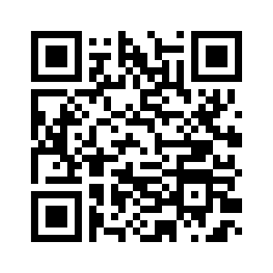

# Projects

## [Solarmeter](./solarmeter) 

> 2020/07/15

The project on renewable energy at AISVN in Nha Be, Vietnam, includes a 500W wind generator and three solar panels from 1W to 60W. Two ESP32 measure independently several key values every minute and submit the average of 5 mintues into a database and a Google sheet. Further detailled description at [https://sites.google.com/ais.edu.vn/solar](https://sites.google.com/ais.edu.vn/solar) .

- Weatherstation - data collection since 2017, comprehensive analysis and documentation will follow
- [407B](./407B) In front of 407B should be a little selection of Arduino projects to get students interested.
- [temp.hofkoh.de](./temp.hofkoh.de) Starting in November 2013 a DS18S20 onewire thermometer connected to a TP-Link TL-WR703N with OpenWRT and a DS9490R USB dongle was measuring the outdoor temperature in Hofkoh, Germany.

# Robot cars

- [T500](./T500) __2020/02/02__  Robot car with 3 omnidirectional wheels, controlled by a Raspberry Pi 3.
- [T420](./T420) __2020/03/01__ Extended robot car from T400, controlled by a NVIDIA Jetson Nano.
- [T410](./T410) __2020/02/02__ Upgrade of T400 with Raspberry Pi 1B and 3.5 inch display 480x320 for 80x25 characters.

## [T400](./T400) 

> 2020/02/24

Robot car for ASA session III at AISVN. Programmed in MicryPython. Powered by an ESP8266.

- [aisvn](./aisvn) __2020/03/10__ Platform standards for interoperability between different robot car generations.

## [T300](./T300)

> 2019/12/23 

Third iteration of student robots at AISVN. Started ASA session II at AISVN in November 2019. Was about to be finished in February 2020, but schools in Vietnam were closed after TET in January 2020. The prototype was finished and can be seen on the right. It includes:

- Motorshield L298 with buzzer on pin4
- 4 DoF robot arm with 4 servos on pin A0 to A3
- Bluetooth Low Energy connection with pin 0 and 1 (Serial1)
- PWM motor control on pin 10 to 13
- 1602 LCD display over I2C on pin 2 and 3 SDA SCL
- MPU6050 gyroscope for location control on I2C
- Ultrasonic distance with pin 7 (trigger) and pin 8 (echo/response)
- PS2X controller at pin 5 SC, 6 CLK, A4 DAT and A5 CMD

# [ASA](./asa) 

>  2019/10/03 

Second iteration of student robots at AISVN. 60% of the 10 projects were successful. The "After School Activity" ASA ran from August to November 2019. Remote control using Bluetooth 4.0 runs on Android and iOS.

## [T200](./T200)

> 2019/04/07

This new robot has a 32bit CPU with 240 MHz in its center - the ESP32. Bluetooth BLE and WiFi are now automatically included. The reverse engineering of the BLE protocol took some time, but now the speed control is analog and allows slow motion

## [T80](./T80)

> 2019/03/06

Viet's robot for the [Sciencefair 2019](https://sites.google.com/ais.edu.vn/sciencefair2019) at AIS in the __Design__ category. His team won!

## [T100](./T100)

> 2018/11/22 

This is the first working example of student robot with Bluetooth control. Created during our club time in 2018-2019. We had a [Presentation in black box](https://docs.google.com/presentation/d/1IE6vhY4cZSOWBHvVIj3YtGkaSpueGU_R7iqlo0ujIk4/edit?usp=sharing) on November 23rd, 2018. And two videos from October 2018: [30 seconds robot built](https://youtu.be/4jvJJgrxoKo) and [presentation of projects](https://youtu.be/MgGgulE-zuQ). The first one has been updated with music and [can be found here](https://youtu.be/CzpAYpl62GI).

# Labs

## [Labs for physics, chemistry and biology](./labs) 

Labs with data as .csv or .xlsx as well as Jupyter Notebooks.

## [IB Physics slides and worksheets](./physics) 

Documents in pptx, docx, pdf and Jupyter notebook ipynb.

# Software

## [AR65view](ar65view)

> 2008/02/23

Developed since 2007 this little Java program might be ported to a native app one day.

## [Python2018](./python2018) 

> 2018/11/16

Starting at the _BeTogetherConference_ of several international schools in Saigon I wrote my first lines in python. Little did I know that soon I would be use it for lab reports in Jupyter notebooks and programming ML and data analysis in Kaggle.

# Projects II

- [AQI](./aqi) Several stations to measure PM2.5, PM10, humidity, temperature and ozone. Some data regularly published to the internet.
- [407B](./407B) In front of 407B should be a little selection of Arduino projects to get students interested.
- [ultrasonic](./ultrasonic) Measure distance with ultrasound.
- [RFID](./rfid) Check out your serial number hidden in your school ID card.

[AQI](https://kreier.github.io/aqi/)

