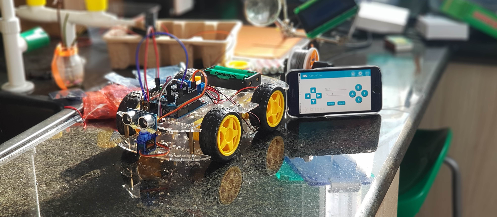

# Coding, Robotics and Data Science with the Environment

These are some projects I work on:

- [T300](./T300) Third iteration of student robots at AISVN. Started second ASA session on November 2019.
- [AQI](./aqi) Several stations to measure PM2.5, PM10, humidity, temperature and ozone. Some data regularly published to the internet.
- [ASA](./asa) Second iteration of student robots at AISVN. 60% of the 10 projects were successful. Started August 2019.
- [T80](./T80) Viet's robot for the [Sciencefair 2019](https://sites.google.com/ais.edu.vn/sciencefair2019) at AIS in the __Design__ category. His team won!
- [T100](./T100) First working example of student robot with Bluetooth control. Created during club time 2018-2019 once a week.

## History

### T-300

<small>2019/11/19</small>

### ASA robot

The project is [here - ASA](https://kreier.github.io/asa/).

### AQI measurement and map 

[AQI](https://kreier.github.io/aqi/)

